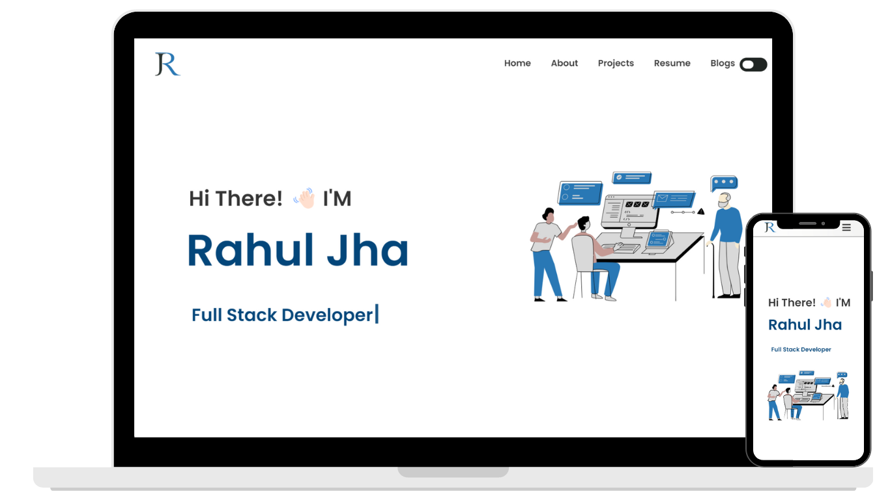

<h2 align="center">
  Rahul Jha | Portfolio Website 
  <a href="https://rahuljha.vercel.app/" target="_blank">rahuljha.vercel.app</a>
</h2>

  

 

 &nbsp;

<h3 align="center">
    🔹
    <a href="https://github.com/rahuljha4171/Portfolio-Website/issues">Report A Bug</a> &nbsp; &nbsp;
    🔹
    <a href="https://github.com/rahuljha4171/Portfolio-Website/issues">Request A Feature</a>
</h3>

You can fork this repo to modify and make changes of your own. Please give me proper credit by linking back to [Rahuljha4171](https://github.com/rahuljha4171/Portfolio-Website). Thanks in Advance!

## Built With

My personal portfolio <a href="https://rahuljha.vercel.app/" target="_blank">rahuljha.vercel.app</a> which features some of my github projects as well as my resume and technical skills. 

This project was built using these technologies.

- React.js
- CSS3
- VsCode
- Vercel

## Features

**Multi-Page Layout**

**Styled with React-Bootstrap and Css**

**Fully Responsive**

**Dark and Light Theme**

## Getting Started

Clone down this repository. You will need `node.js` and `git` installed globally on your machine.

## 🛠 Installation and Setup Instructions

1. Installation: `npm install`

2. In the project directory, you can run: `npm start`

Runs the app in the development mode.\
Open [http://localhost:3000](http://localhost:3000) to view it in the browser.
The page will reload if you make edits.

## Usage Instructions

Open the project folder and Navigate to `/src/components/`.  
You will find all the components used and you can edit your information accordingly.

### Show your support

Give a ⭐ if you like this website!
